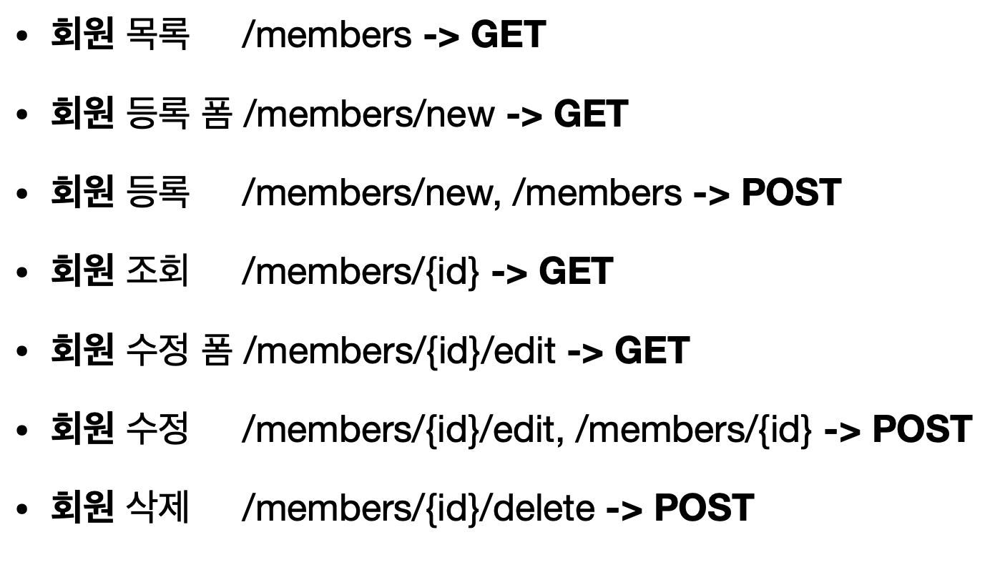
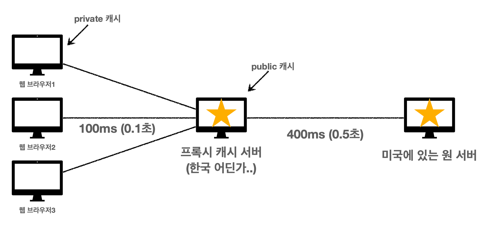

# 모든 개발자를 위한 HTTP 웹 기본 지식

# 인터넷 네트워크

- 인터넷 통신
- IP(Internet Protocol)
- TCP, UDP
- PORT
- DNS

## **인터넷에서 컴퓨터 둘은 어떻게 통신할까?**

## IP(인터넷 프로토콜)

클라이언트 서버 컴퓨터마다 IP주소가 있다.

- 지정한 IP 주소(IP Address)에 데이터 전달
- 패킷(Packet)이라는 통신 단위로 데이터 전달

### IP 패킷

출발 IP, 도착 IP, 기타...전송할 데이터와 함께 보냄

### **IP 프로토콜의 한계**

- **비연결성**
    - 패킷을 받을 대상이 없거나 서비스 불능 상태여도 패킷 전송 (전송할 컴퓨터가 꺼져있다면?)
- **비신뢰성**
    - 중간에 패킷이 사라지면? 복잡한 인터넷 망에서 사라지기 가능
    - 패킷이 순서대로 안오면?

        데이터를 패킷으로 나눠서 보내는데 이렇게 도착할 수 있음

        1. Hello! 2. World! →  2. World! 1. Hello!

        상대방이 잘못 받을 수 있음

- **프로그램 구분**
    - 같은 IP를 사용하는 서버에서 통신하는 애플리케이션이 둘 이상이면?

→ 한계들 IP만으로 극복 x 그래서 나온 개념 TCP

## TCP, UDP

### 인터넷 프로토콜 스택의 4계층

- 애플리케이션 계층 HTTP, FTP
- 전송 계층 - TCP, UDP
- 인터넷 계층 - IP
- 네트워크 인터페이스 계층 (LAN 카드)

### 프로토콜 계층

만약 Hello World 라고 채팅을 보낼경우~?


### TCP/IP 패킷 정보

IP 패킷 - 출발지 IP, 목적지 IP, 등,,,

TCP 패킷 - 출발지 PORT, 목적지 PORT, 전송제어, 순서, 검증 등,,

### TCP 특징

: 전송 제어 프로토콜(Transmission Control Protocol)

- 연결지향 - TCP 3 way handshake (가상 연결)
- 데이터 전달 보증
- 순서 보장
- 신뢰할 수 있는 프로토콜
- 현재는 대부분 TCP 사용함

### TCP 3 way handshake (가상 연결)


클라이언트가 서버에게 1. SYN(접속 요청) 보냄

서버가 켜져있다면 클라이언트에게 2. SYN+ACK(나도 접속요청 + 요청 수락)

클라이언트는 3. ACK+데이터 요청

이런 절차는 중간 복잡한 인터넷망과 상관없이 둘끼리의 논리적인 연결임 → 아 우리 연결되어있구나! 서로만 앎

### 데이터 전달 보증

클라이언트가 데이터를 전송하면 서버는 잘 받았다고 말해줌

### 순서 보장

클라이언트가 패킷 1, 2, 3 순서로 전송하다가

서버에 패킷 1, 3 도착하면 패킷 2부터 다시보내줘~ 요청

## UDP

사용자 데이터그램 프로토콜(User Datagram Protocol)

- 하얀 도화지에 비유(기능이 거의 없음)
- 연결지향 - TCP 3 way handshake X
- 데이터 전달 보증 X
- 순서 보장 X
- **데이터 전달 및 순서가 보장되지 않지만, 단순하고 빠름 정리**
- IP와 거의 같다. +PORT +체크섬 정도만 추가
- 애플리케이션에서 추가 작업 필요

## PORT

만약 같은 서버내에 둘 이상 연결해야 한다면? → PORT 로 구분

**같은 IP 내에서 프로세스 구분**

0 ~ 65535 할당 가능
0 ~ 1023: 잘 알려진 포트, 사용하지 않는 것이 좋음

- FTP - 20, 21
- TELNET - 23
- HTTP - 80
- HTTPS - 443

## DNS

**도메인 네임 시스템(Domain Name System)**

- 전화번호부
- 도메인 명을 IP 주소로 변환
1. 도메인 명 [google.com](http://google.com)을 DNS 서버에 전송
2. 예) 200.200.200.2(구글 IP) 를 클라이언트에게 응답
3. 클라이언트는 200.200.200.2로 접속

# **URI와 웹 브라우저 요청 흐름**

## URI? URL? URN?

**URI는 로케이터(locator), 이름(name) 또는 둘다 추가로 분류될 수 있다**


## URI

**U**niform: 리소스 식별하는 통일된 방식

**R**esource: 자원, URI로 식별할 수 있는 모든 것(제한 없음)

**I**dentifier: 다른 항목과 구분하는데 필요한 정보

URL: Uniform Resource Locator

URN: Uniform Resource Name

### **URL, URN**

URL - Locator: 리소스가 있는 위치를 지정

URN - Name: 리소스에 이름을 부여

위치는 변할 수 있지만, 이름은 변하지 않는다.
→ URN 이름만으로 실제 리소스를 찾을 수 있는 방법이 보편화 되지 않음
URL URI 거의 같은 의미

## URL 문법

> scheme://[userinfo@]host[:port][/path][?query][#fragment]
>

```java
https://www.google.com:443/search?q=hello&hl=ko
```

- 프로토콜 (https)
- 호스트명 www.google.com
- 포트번호 443(https 포트 생략)
- 패스 (/search)
- 쿼리 파라미터 (q=hello&hl=ko)

### scheme

- 주로 프로토콜 사용
    - 프로토콜 : 어떤 방시으로 자원에 접근할 것인가 하는 약속 규칙 (http, https, ftp...)
- http : 80 https : 443 포트 주로 사용, 생량 가능
    - http → 보안 추가 → https

### userinfo

- URL에 사용자 정보를 포함해서 인증
- 거의 사용하지 않음

### host

- 호스트명
- 도메인명 또는 IP주소를 직접 사용 가능

### PORT

- 접속 포트
- 일반적으로 생략함 443 80...

### PATH

- 리소스 경로(path), 계층적 구조
    - /members → 멤버 전체 조회
    - /members/100 → 100번 멤버 조회

### QUERY

- key=value 형태
- ?로 시작, &로 추가 가능 ?keyA=valueA&keyB=valueB
- query parameter, query string 등으로 불림, 웹서버에 제공하는 파라미터, 문자 형태

### FRAGMENT

- fragment
- html 내부 북마크 등에 사용 (html#누르면_여기로_이동)
- 서버에 전송하는 정보 아님

## 웹 브라우저 요청 흐름

https://www.google.com:443/search?q=hello&hl=ko

[www.google.com](http://www.google.com) - DNS 조회

443 - HTTPS PORT
웹 브라우저가 구글 서버에 HTTP 요청 메시지 생성

> **GET /search?q=hello&hl=ko HTTP/1.1
Host: www.google.com**
>

TCP/IP패킷에 HTTP 메시지담아서 보냄
****


> **HTTP/1.1 200 OK
Content-Type: text/html;charset=UTF-8
Content-Length: 3423
<html>
<body>...</body>
</html>**
>

HTTP 응답 메시지 다시 TCP/IP 패킷에 담겨져서 클라이언트에 응답 → HTML 렌더링으로 보여짐

# HTTP

**HyperText Transfer Protocol**

문서간 연결 HTML 로 시작

지금은 이미지 영상 파일 등등 모든 형태의 파일 전송

- HTML, TEXT
- IMAGE, 음성, 영상, 파일
- JSON, XML (API)
- 거의 모든 형태의 데이터 전송 가능
- 서버간에 데이터를 주고 받을 때도 대부분 HTTP 사용
- **지금은 HTTP 시대!**

## HTTP 역사

- HTTP/0.9 1991년: GET 메서드만 지원, HTTP 헤더X
- HTTP/1.0 1996년: 메서드, 헤더 추가
- **HTTP/1.1 1997년: 가장 많이 사용, 우리에게 가장 중요한 버전**
    - RFC2068 (1997) -> RFC2616 (1999) -> RFC7230~7235 (2014)
- HTTP/2 2015년: 성능 개선
- HTTP/3 진행중: TCP 대신에 UDP 사용, 성능 개선

## 기반 프로토콜

- **TCP:** HTTP/1.1, HTTP/2
- **UDP:** HTTP/3현재 HTTP/1.1 주로 사용
- HTTP/2, HTTP/3 도 점점 증가

## HTTP 특징

- 클라이언트 서버 구조
- 무상태 프로토콜(스테이스리스), 비연결성
- HTTP  메시지
- 단순함, 확장 가능

### 클라이언트 서버 구조

- Request Response 구조
- 클라이언트는 서버에 요청을 보내고, 응답을 대기
- 서버가 요청에 대한 결과를 만들어서 응답

→ 서로 독립적 ( 클라이언트는 복잡한 로직은 백엔드에 맡긴채 UI/UX 집중 가능과 같은...)

### 무상태 프로토콜

**스테이스리스(Stateless)**

- 서버가 클라이언트의 상태를 보존X
    - 상태유지 Stateful
        - 고객: 이 **노트북** 얼마인가요?점원: 100만원 입니다. **(노트북 상태 유지)**
        - 고객: **2개** 구매하겠습니다.점원: 200만원 입니다. **신용카드, 현금중**에 어떤 걸로 구매 하시겠어요?**(노트북, 2개 상태 유지)**
        - 고객: 신용카드로 구매하겠습니다.점원: 200만원 결제 완료되었습니다. **(노트북, 2개, 신용카드 상태 유지)**
    - **무상태 Stateless**
        - 고객: 이 **노트북** 얼마인가요?
        점원**A**: 100만원 입니다.
        - 고객: **노트북 2개** 구매하겠습니다.

            점원**B**: 노트북 2개는 200만원 입니다. **신용카드, 현금중**에 어떤 걸로 구매 하시겠어요?

        - 고객: **노트북 2개를 신용카드**로 구매하겠습니다.
        점원**C**: 200만원 결제 완료되었습니다.
    - **무상태:** 중간에 다른 점원으로 바뀌어도 된다.
        - 갑자기 고객이 증가해도 점원을 대거 투입할 수 있다.
        - 갑자기 클라이언트 요청이 증가해도 서버를 대거 투입할 수 있다.
    - 무상태는 응답 서버를 쉽게 바꿀 수 있다. -> **`무한한 서버 증설 가능`**


- 장점: 서버 확장성 높음(스케일 아웃)
- 단점: 클라이언트가 추가 데이터 전송

### 한계

- 모든 것을 무상태로 설계 할 수 있는 경우도 있고 없는 경우도 있다.
- 상태 유지
    - 예) 로그인
- 로그인한 사용자의 경우 로그인 했다는 상태를 서버에 유지
- 일반적으로 브라우저 쿠키와 서버 세션등을 사용해서 상태 유지
- 상태 유지는 최소한만 사용
- 클라이언트측에서 데이터를 많이 보내야함

### 비연결성

- HTTP는 기본이 연결을 유지하지 않는 모델
- 일반적으로 초 단위의 이하의 빠른 속도로 응답
- 1시간 동안 수천명이 서비스를 사용해도 실제 서버에서 동시에 처리하는 요청은 수십개 이
하로 매우 작음
    - 예) 웹 브라우저에서 계속 연속해서 검색 버튼을 누르지는 않는다.
- 서버 자원을 매우 효율적으로 사용할 수 있음

### **한계와 극복**

- TCP/IP 연결을 새로 맺어야 함 - 3 way handshake 시간 추가
- 웹 브라우저로 사이트를 요청하면 HTML 뿐만 아니라 자바스크립트, css, 추가 이미지 등 수 많은 자원이 함께 다운로드
- 지금은 HTTP 지속 연결(Persistent Connections)로 문제 해결
- HTTP/2, HTTP/3에서 더 많은 최적화

HTTP 초기에는 연결 종료 시간이 낭비됨 (연결 HTML 종료, 연결 image 종료, 연결 스크립트 종료)

현재는 지속 연결로 (연결 HTML image 스크립트 종료)

## HTTP 메시지

**HTTP 메시지에 모든 것을 전송**


### 시작 라인

> **GET /search?q=hello&hl=ko HTTP/1.1**
>

```java
**request-line** = method SP(공백) request-target SP HTTP-version CRLF(엔터)
```

- HTTP 메서드 (GET: 조회)
    - 종류: GET, POST, PUT, DELETE...
    - 서버가 수행해야 할 동작 지정
- 요청 대상 (/search?q=hello&hl=ko)
    - absolute-path[?query] (절대경로[?쿼리])
    - 절대경로= "/" 로 시작하는 경로
- HTTP Version

> **HTTP/1.1 200 OK**
>

```java
**status-line** = HTTP-version SP status-code SP reason-phrase CRLF
```

- HTTP 버전
- HTTP 상태 코드: 요청 성공, 실패를 나타냄
    - 200: 성공
    - 400: 클라이언트 요청 오류
    - 500: 서버 내부 오류


### HTTP 헤더

> header-field = field-name ":" OWS
>

```java
**Content-Type: text/html;charset=UTF-8
Content-Length: 3423**
```

- HTTP 전송에 필요한 모든 부가정보
    - 예) 메시지 바디의 내용, 메시지 바디의 크기, 압축, 인증, 요청 클라이언트(브라우저) 정보,
    서버 애플리케이션 정보, 캐시 관리 정보

### HTTP 메시지 바디

```java
**<html>
<body>...</body>
</html>**
```

- 실제 전송할 데이터
- HTML 문서, 이미지, 영상, JSON 등등 byte로 표현할 수 있는 모든 데이터 전송 가능

## HTTP 정리

- HTTP 메시지에 모든 것을 전송
- HTTP 역사 HTTP/1.1을 기준으로 학습
- 클라이언트 서버 구조
- 무상태 프로토콜(스테이스리스)
- HTTP 메시지
- 단순함, 확장 가능
- **지금은 HTTP 시대**

# **HTTP 메서드**

### 요구사항

**회원 정보 관리 API를 만들어라.**

### **API URI 고민**

- **회원이라는 개념 자체가 바로 리소스다**
- **회원이라는 리소스만 식별하면 된다. -> 회원 리소스를 URI에 매핑**

→**가장 중요한 것은** **리소스 식별 URI는 리소스만 식별!**

- **회원** 목록 조회 /members
- **회원** 조회 /members/{id}
- **회원** 등록 /members/{id}
- **회원** 수정 /members/{id}
- **회원** 삭제 /members/{id}

→ 그렇다면 조회 등록 수정 삭제는 어떻게 구분? HTTP 메소드

### HTTP 메서드 종류

- GET: 리소스 조회
- POST: 요청 데이터 처리, 주로 등록에 사용
- PUT: 리소스를 대체, 해당 리소스가 없으면 생성
- PATCH: 리소스 부분 변경
- DELETE: 리소스 삭제

기타....

- **HEAD:** GET과 동일하지만 메시지 부분을 제외하고, 상태 줄과 헤더만 반환
- **OPTIONS:** 대상 리소스에 대한 통신 가능 옵션(메서드)을 설명(주로 CORS에서 사용)
- **CONNECT:** 대상 자원으로 식별되는 서버에 대한 터널을 설정
- **TRACE:** 대상 리소스에 대한 경로를 따라 메시지 루프백 테스트를 수행

## GET

- 리소스 조회
- 서버에 전달하고 싶은 데이터는 query(쿼리 파라미터, 쿼리 스트링)를 통해서 전달
- 메시지 바디를 사용해서 데이터를 전달할 수 있지만, 지원하지 않는 곳이 많아서 권장하지
않음

## POST

- 요청 데이터 처리
- **메시지 바디를 통해 서버로 요청 데이터 전달**
- 서버는 요청 데이터를 처리
    - 메시지 바디를 통해 들어온 데이터를 처리하는 모든 기능을 수행
- 주로 전달된 데이터로 신규 리소스 등록, 프로세스 처리에 사용

**요청 데이터를 어떻게 처리한다는 뜻일까?**

스펙: POST 메서드는 **대상 리소스가 리소스의 고유 한 의미 체계에 따라 요청에 포함 된 표현을 처리하도록 요청**합니다. (구글 번역)

예를 들어 POST는 다음과 같은 기능에 사용됩니다.

- HTML 양식에 입력 된 필드와 같은 데이터 블록을 데이터 처리 프로세스에 제공
    - 예) HTML FORM에 입력한 정보로 회원 가입, 주문 등에서 사용
- 게시판, 뉴스 그룹, 메일링 리스트, 블로그 또는 유사한 기사 그룹에 메시지 게시
    - 예) 게시판 글쓰기, 댓글 달기
- 서버가 아직 식별하지 않은 새 리소스 생성
    - 예) 신규 주문 생성
- 기존 자원에 데이터 추가
    - 예) 한 문서 끝에 내용 추가하기

**정리: 이 리소스 URI에 POST 요청이 오면 요청 데이터를 어떻게 처리할지 리소스마다 따로 정해야 함 > 정해진 것이 없음**

### 정리

**1. 새 리소스 생성(등록)**

서버가 아직 식별하지 않은 새 리소스 생성

**2. 요청 데이터 처리**

단순히 데이터를 생성하거나, 변경하는 것을 넘어서 프로세스를 처리해야 하는 경우
예) 주문에서 결제완료 -> 배달시작 -> 배달완료 처럼 단순히 값 변경을 넘어 프로세스의 상태가 변경되는 경우 POST의 결과로 새로운 리소스가 생성되지 않을 수도 있음
예) POST /orders/{orderId}/start-delivery (**컨트롤 URI**)

**3. 다른 메서드로 처리하기 애매한 경우**

예) JSON으로 조회 데이터를 넘겨야 하는데, GET 메서드를 사용하기 어려운 경우

애매하면 POST

## PUT

- 리소스를 대체
    - 있으면 대체
    - 없으면 생성
    - → 덮어버림 기능
- 클라이언트가 리소스를 식별
    - 클라이언트가 리소스 위치(주체적인 members/100과 같이)를 알고 URI지정 → POST와 큰 차이


username이 사라짐

## PATCH

username 안사라짐 → username : 유지 age : 50

## DELETE

- 리소스 제거

# **HTTP 메서드의 속성**

- 안전(Safe Methods)
- 멱등(Idempotent Methods)
- 캐시가능(Cacheable Methods)

### 안전

- 호출해도 리소스를 변경하지 않는다.

### 멱등

- f(f(x)) = f(x)
- 한 번 호출하든 두 번 호출하든 100번 호출하든 결과가 똑같다.
- 멱등 메서드
    - **GET**: 한 번 조회하든, 두 번 조회하든 같은 결과가 조회된다.
    - **PUT**: 결과를 대체한다. 따라서 같은 요청을 여러번 해도 최종 결과는 같다.
    - **DELETE**: 결과를 삭제한다. 같은 요청을 여러번 해도 삭제된 결과는 똑같다.
    - **POST**: 멱등이 아니다! 두 번 호출하면 같은 결제가 중복해서 발생할 수 있다.
- 서버가 TIMEOUT 등으로 정상 응답을 못주었을 때, 클라이언트가 같은 요청을 다시 해
도 되는가? 자동 복구 메커니즘
- 외부 요인으로 중간에 리소스가 변경되는 것 까지는 고려하지 않는다.

### **캐시가능**

**Cacheable**

- 응답 결과 리소스를 캐시해서 사용해도 되는가?
- GET, HEAD, POST, PATCH 캐시가능
- 실제로는 GET, HEAD 정도만 캐시로 사용
    - POST, PATCH는 본문 내용까지 캐시 키로 고려해야 하는데, 구현이 쉽지 않음

# 클라이언트에서 서버로 데이터 전송

### **데이터 전달 방식은 크게 2가지**

1. **쿼리 파라미터를 통한 데이터 전송**

    - GET
    - 주로 정렬 필터(검색어)
2. **메시지 바디를 통한 데이터 전송**

    - POST, PUT, PATCH
    - 회원 가입, 상품 주문, 리소스 등록, 리소스 변경

### **4가지 상황**

1. **정적 데이터 조회 - 이미지, 정적 텍스트 문서**
2. **동적 데이터 조회 - 주로 검색, 게시판 목록 정렬 필터**
3. **HTML Form을 통한 데이터 전송 - 회원 가입, 상품 주문, 데이터 변경**
4. **HTTP API를 통한 데이터 전송 - 회원가입, 상품주문, 서버 to 서버, 앱/웹 클라이언트,**

### 정적 데이터 조회

> **GET /static/star.jpg HTTP/1.1
Host: localhost:8080**
>
- 이미지, 정적 텍스트 문서
- 조회는 GET 사용
- 정적 데이터는 일반적으로 쿼리 파라미터 없이 리소스 경로로 단순하게 조회 가능

### 동적 데이터 조회

> **GET /search?q=hello&hl=ko HTTP/1.1
Host: www.google.com**
>
- 주로 검색, 게시판 목록에서 정렬 필터(검색어)
- 조회 조건을 줄여주는 필터, 조회 결과를 정렬하는 정렬 조건에 주로 사용
- 조회는 GET 사용
- GET은 쿼리 파라미터 사용해서 데이터를 전달

### HTML Form 데이터 전송

> **<form action="/save" method="post">
<input type="text" name="username" /><input type="text" name="age" /><button type="submit">전송</button>**
>

**웹 브라우저가 생성한 요청 HTTP 메시지**

> **POST /save HTTP/1.1
Host: localhost:8080
Content-Type: application/x-www-form-urlencoded
username=kim&age=20**
>

→ 정보 저장 POST

> **GET /members?username=kim&age=20 HTTP/1.1
Host: localhost:8080**
>

→ 정보 조회 GET

multipart/form-data : 이미지 포함 여러내용 전달

## **HTML Form 데이터 전송** 정리

- HTML Form submit시 POST 전송
    - 예) 회원 가입, 상품 주문, 데이터 변경
- Content-Type: application/x-www-form-urlencoded 사용
    - form의 내용을 메시지 바디를 통해서 전송(key=value, 쿼리 파라미터 형식)
    - 전송 데이터를 url encoding 처리
        - 예) abc김 -> abc%EA%B9%80
- HTML Form은 GET 전송도 가능
- Content-Type: multipart/form-data
    - 파일 업로드 같은 바이너리 데이터 전송시 사용
    - 다른 종류의 여러 파일과 폼의 내용 함께 전송 가능(그래서 이름이 multipart)
- 참고: HTML Form 전송은 **GET, POST만 지원**

## **HTTP API 데이터 전송 정리**

- 서버 to 서버 - 백엔드 시스템 통신
- 앱 클라이언트 - 아이폰, 안드로이드
- 웹 클라이언트
    - HTML에서 Form 전송 대신 자바 스크립트를 통한 통신에 사용(AJAX)
    - 예) React, VueJs 같은 웹 클라이언트와 API 통신
- POST, PUT, PATCH: 메시지 바디를 통해 데이터 전송
- GET: 조회, 쿼리 파라미터로 데이터 전달
- Content-Type: application/json을 주로 사용 (사실상 표준)
    - TEXT, XML, JSON 등등


## HTTP API  설계 예시

- HTTP API - 컬렉션
    - POST 기반 등록 - 회원 관리 API 제공
    - 클라이언트는 등록될 리소스의 URI를 모른다. ( 회원 가입을 할때 회원 가입 버튼 누름( POST → /members로 넘어감) 하면 회원가입 완료 이때 클라이언트가 /members URI를 모른다는 의미인가 )

 

    - 컬렉션(Collection)
        - 서버가 관리하는 리소스 디렉토리
        - 서버가 리소스의 URI를 생성하고 관리
        - 여기서 컬렉션은 /members
- HTTP API - 스토어
    - PUT 기반 등록 - 정적 컨텐츠 관리, 원격 파일 관리
    - 클라이언트가 리소스 URI를 알고 있어야 한다. → 클라이언트가 직접 리소스의 URI를 지정



    - 스토어(Store)
        - 클라이언트가 관리한는 리소스 저장소
        - 클라이언트가 리소스의 URI를 알고 관리
        - 여기서 스토어는 /files
- HTML FORM 사용
    - GET, POST 만 지원 - 웹 페이지 회원 관리
    - AJAX 같은 기술을 사용해서 해결 가능 -> 회원 API 참고
    - 여기서는 순수 HTML, HTML FORM 이야기


    - **컨트롤 URI**
        - GET, POST만 지원 → 제약을 해결하기 위해 동사로 된 리소스 경로 사용
        - POST의 /new, /edit, /delete가 컨트롤 URI → HTTP 메서드로 해결하기 애매한 경우 사용

## 정리

- **문서(document)**

단일 개념(파일 하나, 객체 인스턴스, 데이터베이스 row)

예) /members/100, /files/star.jpg

- **컬렉션(collection)**

서버가 관리하는 리소스 디렉터리
서버가 리소스의 URI를 생성하고 관리
예) /members

- **스토어(store)**

클라이언트가 관리하는 자원 저장소
클라이언트가 리소스의 URI를 알고 관리
예) /files

- **컨트롤러(controller), 컨트롤 URI**

문서, 컬렉션, 스토어로 해결하기 어려운 추가 프로세스 실행
동사를 직접 사용
예) /members/{id}/delete

# HTTP 상태 코드

**클라이언트가 보낸 요청의 처리 상태를 응답에서 알려주는 기능**

- 1xx (Informational): 요청이 수신되어 처리중
- 2xx (Successful): 요청 정상 처리
- 3xx (Redirection): 요청을 완료하려면 추가 행동이 필요
- 4xx (Client Error): 클라이언트 오류, 잘못된 문법등으로 서버가 요청을 수행할 수 없음
- 5xx (Server Error): 서버 오류, 서버가 정상 요청을 처리하지 못함

## 만약 모르는 상태코드가 나타난다면?

- 클라이언트는 상위 상태코드로 해석해서 처리
- 미래에 새로운 상태 코드가 추가되어도 클라이언트를 변경하지 않아도 됨
    - 예 ) 299 → 2xx (클라이언트 : 아 성공 코드구나~)


## 2XX(**Successful)**

**클라이언트의 요청을 성공적으로 처리 ( 보통 다 사용 x )**

- 200 OK - 성공
- 201 Created - **요청 성공해서 새로운 리소스가 생성됨**
- 202 Accepted - **요청이 접수되었으나 처리가 완료되지 않았음**
- 204 No Content - **서버가 요청을 성공적으로 수행했지만, 응답 페이로드 본문에 보낼 데이터가 없음**

## 3XX(Redirection)

**요청을 완료하기 위해 유저 에이전트의 추가 조치 필요**

웹 브라우저는 3xx 응답의 결과에 Location 헤더가 있으면, Location 위치로 자동 이동 (리다이렉트)

- 300 Multiple Choices
- 301 Moved Permanently
- 302 Found
- 303 See Other
- 304 Not Modified
- 307 Temporary Redirect
- 308 Permanent Redirect

## 리다이렉션

### 1. 영구 리다이렉션 - 특정 리소스의 URI가 영구적으로 이동

- 3**01 Moved Permanently**

    **리다이렉트시 요청 메서드가 GET으로 변하고, 본문이 제거될 수 있음(MAY)**

    POST name=hello & age=20 /event → 301 Location: /new-event → GET /new-events

- **308 Permanent Redirect**

    **리다이렉트시 요청 메서드와 본문 유지(처음 POST를 보내면 리다이렉트도 POST 유지)**

    POST name=hello & age=20 /event → 308 Location: /new-event → POST name=hello & age=20 /new-event


### 2. 일시 리다이렉션 - 일시적인 변경

- **302 Found**

    리다이렉트시 요청 메서드가 GET으로 변하고, 본문이 제거될 수 있음(MAY)
    ****

- **307 Temporary Redirect**

    리다이렉트시 요청 메서드와 본문 유지(요청 메서드를 변경하면 안된다. MUST NOT)
    ****

- **303 See Other**

    리다이렉트시 요청 메서드가 GET으로 변경

    예시 ) PRG: Post/Redirect/Get 주문

    POST /orders itemId=mouse → 302 Found Location: /order-result/19 → GET /order-result/19 → 새로고침해도 Get /order-result/19만 다시 요청됨

    - POST로 주문후에 새로 고침으로 인한 중복 주문 방지
    - POST로 주문후에 주문 결과 화면을 GET 메서드로 리다이렉트
    - 새로고침해도 결과 화면을 GET으로 조회

→ 걍 302쓰삼 거의 302씀

### 3. 특수 리다이렉션 - 결과 대신 캐시를 사용

- **304 Not Modified**
캐시를 목적으로 사용

    클라이언트에게 리소스가 수정되지 않았음을 알려준다. 따라서 클라이언트는 로컬PC에 저장된 캐시를 재사용한다. (캐시로 리다이렉트 한다.)

    304 응답은 응답에 메시지 바디를 포함하면 안된다. (로컬 캐시를 사용해야 하므로)

    조건부 GET, HEAD 요청시 사용


## 4xx(Client Error)

**클라이언트 오류**

- **400 Bad Request**
    - **클라이언트가 잘못된 요청을 해서 서버가 요청을 처리할 수 없음**
- **401 Unauthorized**
    - **클라이언트가 해당 리소스에 대한 인증이 필요함**
    - 401 오류 발생시 응답에 WWW-Authenticate 헤더와 함께 인증 방법을 설명
    - 인증(Authentication): 본인이 누구인지 확인, (로그인)
    - 인가(Authorization): 권한부여 (ADMIN 권한처럼 특정 리소스에 접근할 수 있는 권한,
    인증이 있어야 인가가 있음) → 이거 아님
- **403 Forbidden**
    - **서버가 요청을 이해했지만 승인을 거부함 → 인가**
    - 주로 인증 자격 증명은 있지만, 접근 권한이 불충분한 경우
- **404 Not Found**
    - **요청 리소스를 찾을 수 없음**


## 5xx(Server Error)

**서버 오류**

- **500 Internal Server Error**
    - **서버 문제로 오류 발생, 애매하면 500 오류**
- **503 Service Unavailable**
    - **서비스 이용 불가**
    - Retry-After 헤더 필드로 얼마뒤에 복구되는지 보낼 수도 있음 → 근데 거의 예상치 못한 503 오류

# HTTP 헤더

> header-field = field-name ":"  field-value
>
- HTTP 전송에 필요한 모든 부가정보

## 과거 **RFC2616 → 현재 RFC723x**

- 엔티티(Entity) -> 표현(Representation)
- Representation = representation Metadata + Representation Data

## HTTP BODY

- 메시지 본문(message body)을 통해 표현 데이터 전달
- 메시지 본문 = 페이로드(payload) =  표현 데이터
- **표현**은 요청이나 응답에서 전달할 실제 데이터
- 표현 헤더는 표현 데이터를 해석할 수 있는 정보를 제공

## 표현

- Content-Type: 표현 데이터의 형식
    - 미디어 타입, 문자 인코딩 예 ) text/html; charset=utf-8, application/json
- Content-Encoding: 표현 데이터의 압축 방식
    - 데이터를 읽는 쪽에서 인코딩 헤더의 정보로 압축 해제 예 ) gzip, deflate
- Content-Language: 표현 데이터의 자연 언어
    - 예 ) ko, en
- Content-Length: 표현 데이터의 길이
    - 바이트 단위


## 협상(콘텐츠 네고시에이션)

**클라이언트가 선호하는 표현 요청**

- Accept: 클라이언트가 선호하는 미디어 타입 전달
- Accept-Charset: 클라이언트가 선호하는 문자 인코딩
- Accept-Encoding: 클라이언트가 선호하는 압축 인코딩
- Accept-Language: 클라이언트가 선호하는 자연 언어

### 협상과 우선순위

- Quality Values(q) 값 사용
- 0~1, **클수록 높은 우선순위 ( 생략시 1 )**
    - Accept-Language: ko-KR,ko;q=0.9,en-US;q=0.8,en;q=0.7
    1. ko-KR;q=1 (q생략)
    2. ko;q=0.9 ..
- 구체적인 것이 우선한다.
    - Accept: **text/***, **text/plain**, **text/plain;format=flowed**, **/*
    1.** text/plain;format=flowed 2. text/plain ...
- 구체적인 것을 기준으로 미디어 타입을 맞춘다.
    - Accept: **text/***;q=0.3, **text/html**;q=0.7, **text/html;level=1**, **text/html;level=2**;q=0.4, **/***;q=0.5
        1. **text/html;level=1 2. text/html text/html;level=3**


## 전송 방식

- 단순 전송 **Content-Length 그대로 글자수 세서 보냄**
- 압축 전송 **Content-Encoding 압축해서 보냄 → 압축 정보 필요**
- 분할 전송 =**Transfer-Encoding: chunked → 길이 정보 필요 x 분할마다 바이트로 길이정보 표시하기 때문**
- 범위 전송 **Range, Content-Range → 중간까지 받았다 디사받아야하는 경우 사용**

## 일반 정보

- From: 유저 에이전트의 이메일 정보 - 요청
- Referer: 이전 웹 페이지 주소 - 요청
    - A -> B로 이동하는 경우 B를 요청할 때 Referer: A 를 포함해서 요청
    - Referer를 사용해서 유입 경로 분석 가능
- User-Agent: 유저 에이전트 애플리케이션 정보 - 요청
    - 클라이언트의 애플리케이션 정보
- Server: 요청을 처리하는 오리진 서버의 소프트웨어 정보 - 응답
- Date: 메시지가 생성된 날짜 - 응답

## 특별한 정보

- Host: 요청한 호스트 정보(도메인)
    - 하나의 서버가 여러 도메인을 처리해야 할 때 → ip주소만으로 못찾음 host로 도메인 특정지어 보냄
- Location: 페이지 리다이렉션
    - 웹 브라우저는 3xx 응답의 결과에 Location 헤더가 있으면, Location 위치로 자동 이동
    (리다이렉트)
    - 201 : Location 값은 요청에 의해 생성된 리소스 URI
- Allow: 허용 가능한 HTTP 메서드
    - 405 (Method Not Allowed) 에서 응답에 포함해야함
- Retry-After: 유저 에이전트가 다음 요청을 하기까지 기다려야 하는 시간
    - 503 (Service Unavailable): 서비스가 언제까지 불능인지 알려줄 수 있음

## 인증

- Authorization: 클라이언트 인증 정보를 서버에 전달
- WWW-Authenticate: 리소스 접근시 필요한 인증 방법 정의
    - 401 Unauthorized 응답과 함께 사용 - 리소스 접근시 필요한 인증 방법 정의


## 쿠키

- Set-Cookie: 서버에서 클라이언트로 쿠키 전달(응답)
- Cookie: 클라이언트가 서버에서 받은 쿠키를 저장하고, HTTP 요청시 서버로 전달

HTTP는 무상태(Stateless) 프로토콜이기 떄문에 고객이 로그인을 했다고 하여도 상태 유지 x

→ 해결? 쿠키

- 쿠키 정보는 항상 서버에 전송됨 → 웹 브라우저 내부에 데이터를 저장하고 싶으면 웹 스토리지 (localStorage, sessionStorage)
- 네트워크 트래픽 추가 유발 → 최소한의 정보만

### 생명 주기 **Expires, max-age**

- 세션 쿠키: 만료 날짜를 생략하면 브라우저 종료시 까지만 유지
- 영속 쿠키: 만료 날짜를 입력하면 해당 날짜까지 유지

### 도메인

여기저기서 쿠키가 나오는데 다 들고 다닐 수 없으니까

- **명시: 명시한 문서 기준 도메인 + 서브 도메인 포함**
- **략: 현재 문서 기준 도메인만 적용**

### 경로

- **이 경로를 포함한 하위 경로 페이지만 쿠키 접근**
- **일반적으로 path=/ 루트로 지정**

### 보안

- Secure

    쿠키는 http, https를 구분하지 않고 전송

    Secure를 적용하면 https인 경우에만 전송

- HttpOnly

    XSS 공격 방지
    자바스크립트에서 접근 불가(document.cookie)
    HTTP 전송에만 사용

- SameSite

    XSRF 공격 방지

    요청 도메인과 쿠키에 설정된 도메인이 같은 경우만 쿠키 전송


## 캐시와 조건부 요청

### 캐시 없을 때

- 데이터가 변경되지 않아도 계속 네트워크를 통해 데이터를 다운받아야함 → 느리고 비싸고

### 캐시 적용

- 캐시 데이터를 이용하기 때문에 캐시 가능시간동안은 네트워크를 사용하지 않아도 된다.

### 캐시 시간 초과

- 캐시 유효 시간이 초과되면, 서버를 통해 데이터를 다시 조회하고, 캐시를 갱신 → 다시 네트워크 다운로드가 생김

→ 해결?

## 검증 헤더와 조건부 요청

### 캐시 시간 초과

1. 서버에서 기존 데이터를 변경함
- **200 OK**, 모든 데이터 전송(BODY 포함)
1. 서버에서 기존 데이터를 변경하지 않음
- 효율적으로 캐시에 있는 데이터를 재사용 → 조건 : 클라이언트의 캐시와 서버의 데이터가 같아야 함
    - 확인 방법
        - 검증 헤더 : 캐시 데이터와 서버 데이터가 같은지 검증하는 데이터
        - Last-Modified

             - ETag

        - 조건부 요청 헤더 : 검증 헤더로 조건에 따른 분기

            -If-Modified-Since : 이후에 데이터가 수정되었으면?
            -If-None-Match

- 절차
    - 캐시 유효 시간이 초과해도, 서버의 데이터가 갱신되지 않으면 → 304 Not Modified + 헤더 정보만 응답 ( 바디 전달  x)  →  클라이언트는 서버가 보낸 응답 헤더 정보로 캐시의 메타 정보를 갱신(Last Modified...) → 데이터 재활용 → 네트워크 다운로드는 발생(304) 용량이 매우 작음

### **Last-Modified, If-Modified-Since 단점**

- 1초 미만(0.x초) 단위로 캐시 조정이 불가능 → 1초 미만으로 캐시 데이터 기간 정할 일 x
- 날짜 기반의 로직 사용
- 데이터를 수정해서 날짜가 다르지만, 같은 데이터를 수정해서 데이터 결과가 똑같은 경우
    - 예 ) aaa → bbb → aaa 변경 했지만 데이터는 똑같음


### **ETag, If-None-Match**

- ETag(Entity Tag) : 캐시용 데이터에 임의의 고유한 버전 이름을 달아둠
- 데이터가 변경되면 이름을 바꿈 ( Hash를 다시 생성 ) 변경되어도 hash를 통해 같은 파일을 반환함
- **캐시 제어 로직을 서버에서 완전히 관리**

## 캐시와 조건부 요청 헤더

### 캐시 제어 헤더

- Cache-Control: 캐시 제어
    - **캐시 지시어(directives)**
    - max-age : 캐시 유효 시간, 초 단위
    - no-cache : 데이터는 캐시해도 되지만, 항상 원(origin) 서버에 검증하고 사용해야함
    - no-store : 데이터에 민감한 정보가 있으므로 저장하면 안됨 ( 메모리에서 사용하고 삭제해 )
- Pragma: 캐시 제어(하위 호환)
- Expires: 캐시 유효 기간(하위 호환)
    - 정확한 날짜를 지정 → 유연하지 x max-age 권장(초단위)


## 프록시 캐시



### **Cache-Control**

- **Cache-Control: public - 응답이 public 캐시에 저장되어도 됨**
- **Cache-Control: private - 응답이 해당 사용자만을 위한 것임, private 캐시에 저장해야 함(기본값)**
- **Cache-Control: s-maxage - 프록시 캐시에만 적용되는 max-age**

### 캐시 무효화

- **Cache-Control: no-cache -** 데이터는 캐시해도 되지만, 항상 **원 서버에 검증**하고 사용
- **Cache-Control: no-store -** 데이터에 민감한 정보가 있으므로 저장하면 안됨
- **Cache-Control: must-revalidate -** 캐시 만료후 최초 조회시 **원 서버에 검증**해야함
    - 원 서버 접근 실패시 반드시 오류가 발생해야함 - 504(Gateway Timeout)
    - must-revalidate는 캐시 유효 시간이라면 캐시를 사용함

> **no-cache ㄷ must-revalidate**
>

if **no-cache**

캐시 서버 요청(**no-cache**) → 프록시 캐시 원 서버에 접근할 수 없는 경우 캐시 서버 설정에 따라서 캐시 데이터를 반환할 수 있음 but **원 서버와 순간 네트워크 단절로 접근 불가** → **오류보다는 오래된 데이터라도 보여주자**...(200OK)

if **must-revalidate**

캐시 서버 요청(**must-revalidate**) → **원 서버에 접근할 수 없는 경우, 항상 오류가 발생해야 함 and** **원 서버와 순간 네트워크 단절로 접근 불가** → **504 Gateway Timeout**