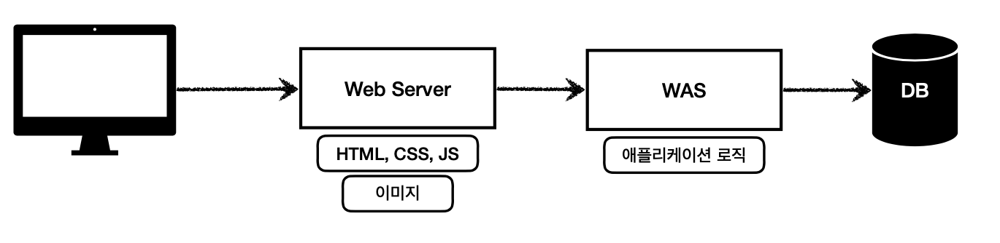
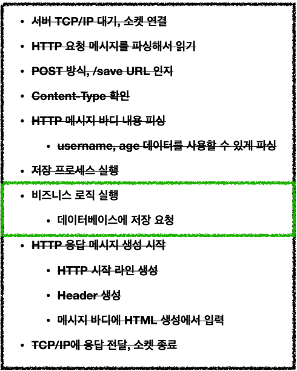
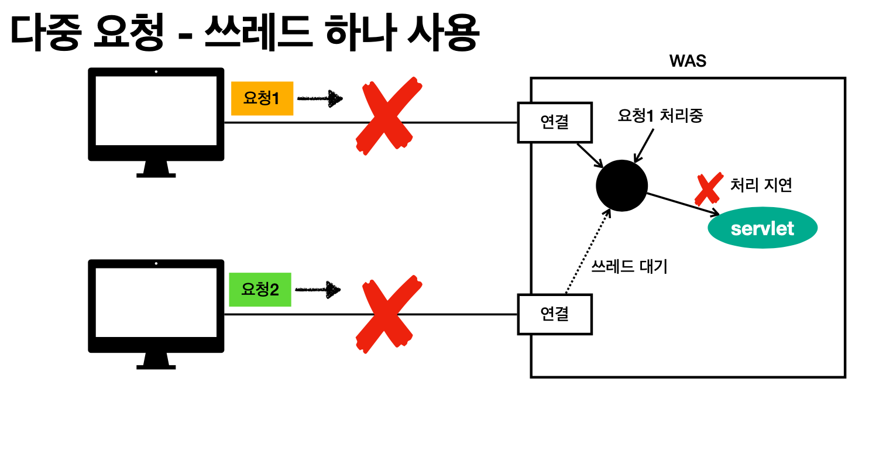
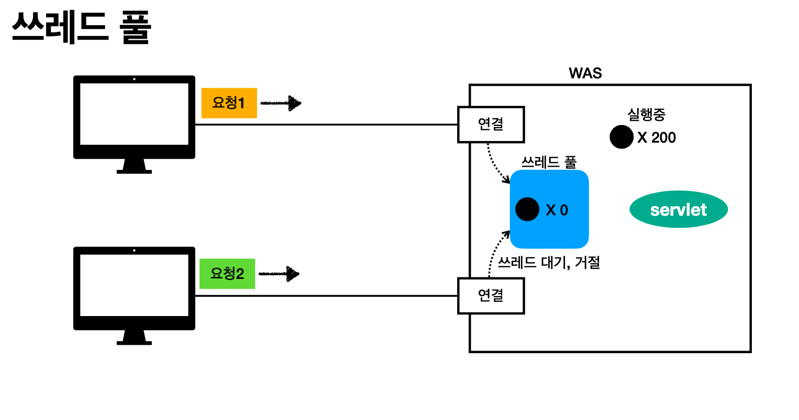

# 01. 웹 애플리케이션의 이해

# 웹 서버, 웹 애플리케이션 서버

## 웹 - HHTP 기반

## 웹 서버(web Server)

- HTTP 기반으로 동작
- 정적 리소스 제공, 기타 부가기능
- 정적(파일) HTML, CSS, JS, 이미지, 영상
- 예) NGINX, APACHE

## **웹 애플리케이션 서버(WAS - Web Application Server)**

- HTTP 기반으로 동작
- 웹 서버 기능 포함+ (정적 리소스 제공 가능)
- 프로그램 코드를 실행해서 애플리케이션 로직 수행
    - 동적 HTML, HTTP API(JSON)
    - 서블릿, JSP, 스프링 MVC
- 예) 톰캣(Tomcat) Jetty, Undertow

## 차이점

- 웹 서버는 정적 리소스(파일), WAS는 애플리케이션 로직
- 사실은 둘의 용어도 경계도 모호함
    - 웹 서버도 프로그램을 실행하는 기능을 포함하기도 함
    - 웹 애플리케이션 서버도 웹 서버의 기능을 제공함
- 자바는 서블릿 컨테이너 기능을 제공하면 WAS (서블릿 없이 자바코드를 실행하는 서버 프레임워크도 있음)
- WAS는 애플리케이션 코드를 실행하는데 더 특화

### 웹 시스템 구성 - WAS, DB

- WAS, DB 만으로 시스템 구성 가능 → WAS는 정적 리소스, 애플리케이션 로직 모두 제공 가능
- WAS가 너무 많은 역할을 담당, 서버 과부하 우려 → 가장 비싼 애플리케이션 로직이 정적 리소스 때문에 수행이 어려울 수 있음
- WAS 장애시 오류 화면도 노출 불가능 (정적파일 조차 장애때문에 화면 노출이 불가)

### **웹 시스템 구성 WEB, WAS, DB**

- 정적 리소스는 웹 서버가 처리
- 웹 서버는 애플리케이션 로직같은 동적인 처리가 필요하면 WAS에 요청을 위임
- 효율적인 리소스 관리 → 각 web 서버 was 서버 증설 가능
- WAS 잘 죽어도 정적 리소스만 제공하는 웹 서버는 잘 죽지 않음 → WEB 서버가 오류 화면 제공 가능

## 서블릿

### 서블릿을 지원하는 WAS 사용

### 특징

- HTTP 요청 정보를 편리하게 사용할 수 있는 HttpServletRequest / HTTP 응답 정보를 편리하게 제공할 수 있는 HttpServletResponse
- WAS는 Request, Response 객체를 새로 만들어서 서블릿 객체 호출
- 개발자는 Request 객체 꺼냄 → Response 객체 입력 (편리)
- WAS는 Response 객체에 담겨있는 내용으로 HTTP 응답 정보를 생성

### 서블릿 컨테이너

- 톰캣처럼 서블릿을 지원하는 WAS를 서블릿 컨테이너라고 함
- 서블릿 컨테이너는 서블릿 객체를 생성, 초기화, 호출, 종료하는 생명주기 관리
- 서블릿 객체는 **싱글톤으로 관리 → 계속 객체 생성 비효율 → 모든 고객 요청은 동일한 서블릿 객체 인스턴스에 접근**
- 동시 요청을 위한 멀티 쓰레드 처리 지원

## **동시 요청 - 멀티 쓰레드**

### 쓰레드

- 애플리케이션 코드를 하나하나 순차적으로 실행하는 것은 쓰레드
- 자바 메인 메서드를 처음 실행하면 main이라는 이름의 쓰레드가 실행
- 쓰레드가 없다면 자바 애플리케이션 실행이 불가능
- 쓰레드는 한번에 하나의 코드 라인만 수행
- 동시 처리가 필요하면 쓰레드를 추가로 생성

→ 한개의 요청을 처리 중 지연이 나면 대기 → 오래 대기 시 둘다 응답 실패

~해결~

### **요청 마다 쓰레드 생성**

- 장점
    - 동시 요청을 처리할 수 있다.
    - 리소스(CPU, 메모리)가 허용할 때 까지 처리가능
    - 하나의 쓰레드가 지연 되어도, 나머지 쓰레드는 정상 동작한다.
- 단점
    - 쓰레드는 생성 비용은 매우 비싸다.
        - 고객의 요청이 올 때 마다 쓰레드를 생성하면, 응답 속도가 늦어진다.
    - 쓰레드는 컨텍스트 스위칭 비용이 발생한다.
    - 쓰레드 생성에 제한이 없다. → 고객 요청이 너무 많이 오면, CPU, 메모리 임계점을 넘어서 서버가 죽을 수 있다.

    ### 쓰레드 풀 : 요청 마다 쓰레드 보완

- 특징
    - 필요한 쓰레드를 쓰레드 풀에 보관하고 관리한다.
    - 쓰레드 풀에 생성 가능한 쓰레드의 최대치를 관리한다. 톰캣은 최대 200개 기본 설정 (변경 가능)
- 사용
    - 쓰레드가 필요하면, 이미 생성되어 있는 쓰레드를 쓰레드 풀에서 꺼내서 사용한다.
    - 사용을 종료하면 쓰레드 풀에 해당 쓰레드를 반납한다.
    - 최대 쓰레드가 모두 사용중이어서 쓰레드 풀에 쓰레드가 없으면? → 기다리는 요청은 거절하거나 특정 숫자만큼만 대기하도록 설정할 수 있다.
- 장점
    - 쓰레드가 미리 생성되어 있으므로, 쓰레드를 생성하고 종료하는 비용(CPU)이 절약되고, 응답 시간이 빠르다.
    - 생성 가능한 쓰레드의 최대치가 있으므로 너무 많은 요청이 들어와도 기존 요청은 안전하게 처리할 수 있다.

    최대 쓰레드를 너무 낮게 설정한다면? (서버 너무 안사용함)

     → 동시 요청이 많으면, 서버 리소스는 여유롭지만, 클라이언트는 금방 응답 지연

    너무 높게 설정한다면? → 동시 요청이 많으면, CPU, 메모리 리소스 임계점 초과로 서버 다운

    아니 그러면 적정 숫자 어떻게 찾는데?

    ### 쓰레드 풀의 적정 숫자

    애플리케이션 로직의 복잡도, CPU, 메모리, IO 리소스 상황에 따라 모두 다름

    ### WAS의 멀티 쓰레드 지원

- 멀티 쓰레드에 대한 부분은 WAS가 처리
- **개발자가 멀티 쓰레드 관련 코드를 신경쓰지 않아도 됨**
- 개발자는 마치 **싱글 쓰레드 프로그래밍을 하듯이 편리하게 소스 코드를 개발**
- 멀티 쓰레드 환경이므로 싱글톤 객체(서블릿, 스프링 빈)는 주의해서 사용

→ 열라 편함

# HTML, HTTP API, CSR, SSR

### 데이터

- 정적 리소스 : 고정된 HTML 파일, CSS, JS, 이미지, 영상 등을 제공 (주로 웹브라우저) 웹 서버가 이미 생성된 html 전달
- HTML 페이지 : 동적으로 필요한 HTML 파일을 생성해서 전달 WAS가 동적으로 HTML 전달
- HTTP API :
    - HTML이 아니라 데이터를 전달
    - 주로 JSON 형식 사용 - WAS가 JSON 형식 데이터를 전달
    - 데이터만 주고 받음, UI 화면이 필요하면, 클라이언트가 별도 처리
    - 앱, 웹 클라이언트, 서버 to 서버

### 서버사이드 렌더링, 클라이언트 사이드 렌더링

- **SSR - 서버 사이드 렌더링**
    - HTML 최종 결과를 서버에서 만들어서 웹 브라우저에 전달
    - 주로 정적인 화면에 사용
    - 관련기술: JSP, 타임리프 **> 백엔드 개발자**
- **CSR - 클라이언트 사이드 렌더링**
    - HTML 결과를 자바스크립트를 사용해 웹 브라우저에서 동적으로 생성해서 적용
    - 주로 동적인 화면에 사용, 웹 환경을 마치 앱 처럼 필요한 부분부분 변경할 수 있음
    - 예) 구글 지도, Gmail, 구글 캘린더
    - 관련기술: React, Vue.js **> 웹 프론트엔드 개발자**

## 자바 백엔드 웹 기술 역사

- 서블릿 - 1997
    - HTML 생성이 어려움
- JSP - 1999
    - HTML 생성은 편리하지만, 비즈니스 로직까지 너무 많은 역할 담당
- 서블릿, JSP 조합 MVC 패턴 사용
    - 모델, 뷰 컨트롤러로 역할을 나누어 개발
- MVC 프레임워크 춘추 전국 시대 - 2000년 초 ~ 2010년 초
    - MVC 패턴 자동화, 복잡한 웹 기술을 편리하게 사용할 수 있는 다양한 기능 지원
    - 스트럿츠, 웹워크, 스프링 MVC(과거 버전)

***현재 사용 기술***

**애노테이션 기반의 스프링 MVC 등장**

@Controller →MVC 프레임워크의 춘추 전국 시대 마무리

**스프링 부트의 등장**

스프링 부트는 서버를 내장
과거에는 서버에 WAS를 직접 설치하고, 소스는 War 파일을 만들어서 설치한 WAS에 배포
스프링 부트는 빌드 결과(Jar)에 WAS 서버 포함 -> 빌드 배포 단순화

### 완전 최신기술 - **스프링 웹 플럭스(WebFlux)**

**특징**

비동기 넌 블러킹 처리
최소 쓰레드로 최대 성능 - 쓰레드 컨텍스트 스위칭 비용 효율화
함수형 스타일로 개발 - 동시처리 코드 효율화
서블릿 기술 사용X

**그런데**

웹 플럭스는 기술적 난이도 매우 높음
아직은 RDB 지원 부족
일반 MVC의 쓰레드 모델도 충분히 빠르다.