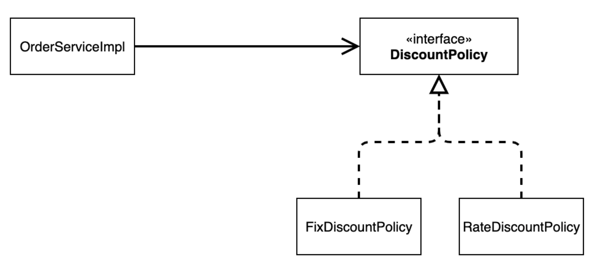

# 02. 객체 지향 원리 적용

---

## 새로운 할인 정책

기획자 : 할인 정책 추가 시켜줘!



```java
public class OrderServiceImpl implements OrderService {
  //    private final DiscountPolicy discountPolicy = new FixDiscountPolicy();
      private final DiscountPolicy discountPolicy = new RateDiscountPolicy();
  }
```

→ DIP OCP 위반

주문 서비스 클라이언트 `OrderServiceImpl`은 `추상(인터페이스) 뿐만 아니라 **구체(구현) 클래스에도 의존**`하고

있다.

- 추상(인터페이스) 의존: `DiscountPolicy`
- 구체(구현) 클래스: `FixDiscountPolicy` , `RateDiscountPolicy`

OCP: 변경하지 않고 확장할 수 있다고 했는데!**지금 코드는 기능을 확장해서 변경하면, 클라이언트 코드에 영향을 준다!** 따라서 **OCP를 위반**한다.

→ `RateDiscount`로 할지 `FixDiscount`로 할지 `OrderServiceImple`은 바뀌지 않아야 OCP위반 되지 않은거임

### 해결 어떻게 하냐?

클라이언트 코드인 `OrderServiceImpl` 은 `DiscountPolicy` 의 인터페이스 뿐만 아니라 구체 클래스도
함께 의존한다.
그래서 구체 클래스를 변경할 때 클라이언트 코드도 함께 변경해야 한다.**DIP 위반** 추상에만 의존하도록 변경(인터페이스에만 의존)

→ DIP를 위반하지 않도록 인터페이스에만 의존하도록 의존관계를 변경하면 된다.

```java
public class OrderServiceImpl implements OrderService {
      private final DiscountPolicy discountPolicy;
  }
```

DIP는 지켰지만 작동이 안됨 구현체가 없기 때문에 `Null Pointer Exception`

→ 이 문제를 해결하려면 누군가가 클라이언트인 `OrderServiceImpl` 에 `DiscountPolicy` 의 구현 객체를 대신 생성하고 주입해주어야 한다.

## 관심사의 분리

공연으로 예시

로미오(인터페이스)의 역할을 맡은 레오나르도 디카프리오(구현체, 배우)가 줄리엣의 역할의 배우를 직접 초빙 + 연기까지 → 너무 많은 책임을 지게 됨 (다양한 책임)

### → 관심사를 분리하자

배우 - 공연

공연기획자 - 섭외

### AppConfig

**구현 객체를 생성**하고, **연결**하는 책임을 가지는 별도의 설정 클래스를 만들자.

AppConfig는 애플리케이션의 실제 동작에 필요한 **구현 객체를 생성**한다.
`MemberServiceImpl`

`MemoryMemberRepository`
`OrderServiceImpl`
`FixDiscountPolicy`

AppConfig는 생성한 객체 인스턴스의 참조(레퍼런스)를 **생성자를 통해서 주입(연결)**해준다.
`MemberServiceImpl` → `MemoryMemberRepository`
`OrderServiceImpl` → `MemoryMemberRepository`  `FixDiscountPolicy`

```java
public class AppConfig {

   //생성자 주입
   public MemberService memberService(){
      return new MemberServiceImpl(new MemoryMemberRepository());
   }

   public OrderService orderService(){
      return new OrderServiceImpl(new MemoryMemberRepository(),new FixDiscountPolicy());
   }
}
```

```java
public class MemberServiceImpl implements MemberService{

	private final MemberRepository memberRepository;

	public MemberServiceImpl(MemberRepository memberRepository) {
		this.memberRepository = memberRepository;
	}
```

- 설계 변경으로 MemberServiceImpl 은 MemoryMemberRepository 를 의존하지 않는다!
- 단지 MemberRepository 인터페이스만 의존한다.
- MemberServiceImpl 입장에서 생성자를 통해 어떤 구현 객체가 들어올지(주입될지)는 알 수 없다.
- MemberServiceImpl 의 생성자를 통해서 어떤 구현 객체를 주입할지는 오직 외부( AppConfig )에서 결정된다.
- MemberServiceImpl 은 이제부터 **의존관계에 대한 고민은 외부**에 맡기고 **실행에만 집중**하면 된다.
- 클라이언트인 memberServiceImpl 입장에서 보면 의존관계를 마치 외부에서 주입해주는 것 같다고 해서 DI(Dependency Injection) 우리말로 의존관계 주입 또는 의존성 주입이라 한다.

```java
public class OrderServiceImpl implements OrderService{

   private final MemberRepository memberRepository;
   private final DiscountPolicy discountPolicy;

   public OrderServiceImpl(MemberRepository memberRepository, DiscountPolicy discountPolicy) {
      this.memberRepository = memberRepository;
      this.discountPolicy = discountPolicy;
   }
```

- 설계 변경으로 `OrderServiceImpl` 은 `FixDiscountPolicy` 를 의존하지 않는다!
- 단지 `DiscountPolicy` 인터페이스만 의존한다.
- `OrderServiceImpl` 에는 `MemoryMemberRepository` , `FixDiscountPolicy` 객체의 의존관계가
주입된다.

## **정리**

- AppConfig를 통해서 관심사를 확실하게 분리했다.
- 배역, 배우를 생각해보자. `AppConfig` → 공연 기획자다. `AppConfig`는 구체 클래스(배우)를 선택한다. == 배역에 맞는 담당 배우를 선택한다. 애플리케이션이 어떻게 동작해야 할지 전체 구성을 책임진다.
- 이제 각 배우들은 담당 기능을 실행하는 책임만 지면 된다. == `MemberServiceImpl` , `OrderServiceImpl` 은 기능을 실행하는 책임만 지면 된다.

## 새로운 할인 정책으로 변경

```java
public class AppConfig {

   //생성자 주입
   public MemberService memberService(){
      return new MemberServiceImpl(MemberRepository());
   }

   private MemberRepository MemberRepository() {
      return new MemoryMemberRepository();
   }

   public OrderService orderService(){
      return new OrderServiceImpl(MemberRepository(),discountPolicy());
   }

   public DiscountPolicy discountPolicy(){
      // return new FixDiscountPolicy();
      return new RateDiscountPolicy();
   }
}
```

- `AppConfig` 에서 할인 정책 역할을 담당하는 구현을 `FixDiscountPolicy` `RateDiscountPolicy`
객체로 변경했다.
- 이제 할인 정책을 변경해도, 애플리케이션의 구성 역할을 담당하는 `AppConfig`만 변경하면 된다.
- 클라이언트 코드인 `OrderServiceImpl` 를 포함해서 **사용 영역**의 어떤 코드도 변경할 필요가 없다.
- **구성 영역**은 당연히 변경된다. 구성 역할을 담당하는 `AppConfig`를 애플리케이션이라는 공연의 기획자로
생각하자. 공연 기획자는 공연 참여자인 구현 객체들을 모두 알아야 한다.

## 좋은 객체 지향 설계의 5가지 원칙

위 해결은 SRP, DIP, OCP 적용됨

### SPR 단일 책임 원칙

**한 클래스는 하나의 책임만 가져야 한다.**

클라이언트 객체가 여러 다양한 책임을 가지고 있으면 안됨 → 관심사 분리가 필요 AppConfig

### DIP 의존관계 역전 원칙

**프로그래머는 “추상화에 의존해야지, 구체화에 의존하면 안된다.” 의존성 주입은 이 원칙을 따르는 방법 중
하나다.**

처음에는 클라이언트 코드가 인터페이스인 DiscountPolicy와 구현체인 FixDiscountPolicy 두곳에 의존 중이였다. → 인터페이스에만 의존하도록 코드 변경(null pointer exception)

AppConfig가 FixDiscountPolicy 객체 인스턴스를 클라이언트 코드 대신 생성해서 클라이언트 코드에 의존관계를 주입했다. 이렇게해서 DIP 원칙을 따르면서 문제도 해결

### OCP 개방 폐쇄 원칙

**소프트웨어 요소는 확장에는 열려 있으나 변경에는 닫혀 있어야 한다**

결과적으로 DiscountPolicy를 Fix → Rate로 변경할때 클라이언트 코드 수정 x AppConfig만 수정하면 됨

→ **소프트웨어 요소를 새롭게 확장해도 사용 영역의 변경은 닫혀 있다!**

## **IoC, DI, 그리고 컨테이너**

**IoC, 제어의 역전**

- 기존 프로그램은 클라이언트 구현 객체가 스스로 필요한 서버 구현 객체를 생성하고, 연결하고, 실행했다.한마디로 구현 객체가 프로그램의 제어 흐름을 스스로 조종했다. 개발자 입장에서는 매우 자연스러운 흐름이었다.
- `AppConfig`의 등장으로 클라이언트 구현 객체는 자신의 로직을 실행하는 역할만 담당하게 되었다.
- 프로그램에 대한 제어 흐름에 대한 권한은 `AppConfig`가 가지고 있다.인터페이스를 구현한 객체를 다루므로 로직의 주도권을 잡고있다고 생각하면 된다.
- 이렇듯 **프로그램의 제어 흐름을 직접 제어하는 것이 아니라 외부에서 관리하는 것**을 **제어의 역전**이라고 한다.

**프레임워크 VS 라이브러리**

- 프레임워크 : 내가 작성한 코드를 제어하고, 대신 실행한다.
- 라이브러리 : 내가 작성한 코드를 내가 직접 제어한다.
- 필자 의견 : 내가 정해진 틀에 맞추어 코딩, 내가 여러 도구를 활용해서 코딩

**DI, 의존관계 주입**

- 의존관계는 **정적인 클래스 의존관계와,실행 시점에 결정되는 동적인 인스턴스 의존관계** 둘을 분리하면서 생각해야한다.

**정적인 클래스 의존관계**클래스가 사용하는 `import`코드만 보고도 의존관계를 쉽게 판단할 수 있다.정적인 의존관계는 애플리케이션을 실행하지 않아도 분석할 수 있다.

`OrderServiceImpl`은 `MemberServiceImpl`과 `DiscountPolicy`에 의존한다는 것을 알 수 있다.그런데 이러한 클래스 의존관계만으로 실제 어떤 객체가 `OrderServiceImpl`에 주입될지는 알 수 없다.

**동적인 객체 인스턴스 의존 관계**애플리케이션 실행 시점에 실제 생성된 객체 인스턴스의 참조가 연결된 의존관계다.

- 애플리케이션 **실행 시점(런타임)** 에 외부에서 실제 구현 객체를 생성하고 클라이언트에 전달해서클라이언트와 서버의 실제 의존관계가 연결되는 것을 **의존관계 주입**이라 말한다.
- 객체 인스턴스를 생성하고, 그 참조 값을 전달해서 연결된다.
- 왼존관계 주입을 사용하면 클라이언트 코드를 변경하지 않고,클라이언트가 호출하는 대상의 타입 인스턴스를 변경할 수 있다.
- 의존관계 주입을 사용하면 정적인 클래스 의존관계를 변경하지 않고,동적인 객체 인스턴스 의존관계를 쉽게 변경할 수 있다.

**IoC 컨테이너, DI 컨테이너**

- AppConfig 처럼 객체를 생성하고 관리하면서 의존관계를 연결해 주는 것을**IoC 컨테이너** 또는 **DI 컨테이너**라고 부른다.
- 의존관계 주입에 초점을 맞추어 최근에는 주로 **DI컨테이너**라 한다.
- 또는 어셉블러, 오브젝트 팩토리 등으로 불리기도 한다.

## 스프링으로 전환하기

**AppConfig**

```java
@Configuration
public class AppConfig {

    @Bean
    public MemberService memberService() {
        return new MemberServiceImpl(memberRepository());
    }

    @Bean
    public OrderService orderService() {
        return new OrderServiceImpl(memberRepository(), discountPolicy());
    }

    @Bean
    public MemberRepository memberRepository() {
        return new MemoryMemberRepository();
    }

    @Bean
    public DiscountPolicy discountPolicy() {
        return new RateDiscountPolicy();
    }

}
```

**MemberApp**

```java
public class MemberApp {

    public static void main(String[] args) {

        ApplicationContext applicationContext = new AnnotationConfigApplicationContext(AppConfig.class);
        MemberService memberService = applicationContext.getBean("memberService", MemberService.class);

        Member member = new Member(1L, "memberA", Grade.VIP);
        memberService.join(member);

        Member findMember = memberService.findMember(1L);
        System.out.println("new Member = " + member.getName());
        System.out.println("find Member = " + findMember.getName());
    }
}
```

**OrderApp**

```java
public class OrderApp {
    public static void main(String[] args) {

        ApplicationContext applicationContext = new AnnotationConfigApplicationContext(AppConfig.class);
        MemberService memberService = applicationContext.getBean("memberService", MemberService.class);
        OrderService orderService = applicationContext.getBean("orderService", OrderService.class);

        Long memberId = 1L;
        Member member = new Member(memberId, "memberA", Grade.VIP);
        memberService.join(member);

        Order order = orderService.createOrder(memberId, "itemA", 20000);

        System.out.println("order = " + order);
        System.out.println("order.calculatePrice() = " + order.calculatePrice());
    }
}
```

**스프링 컨테이너**

- `ApplicationContext`를 스프링 컨테이너라 부른다.
- 기존에는 개발자가 `AppConfig`를 사용해서 직접 객체를 생성하고 DI를 했지만, 스프링 컨테이너를 통해서 사용한다.
- 스프링 컨테이너는 `@Configuration`이 붙은 `AppConfig`를 설정(구성)정보로 사용한다.여기서 `@Bean`이라 적힌 메서드를 모두 호출해서 **반환된 객체를 `스프링 컨테이너`에 등록한다.**이렇게 스프링 컨테이너에 등록된 객체를 **스프링 빈**이라고 말한다.
- 기존에는 개발자가 직접 자바코드로 모든 것을 했다면 이제부터는 스프링 컨테이너에 객체를 스프링 빈으로 등록하고,스프링 컨테이너에서 스프링 빈을 찾아서 사용하다로 변경되었다.