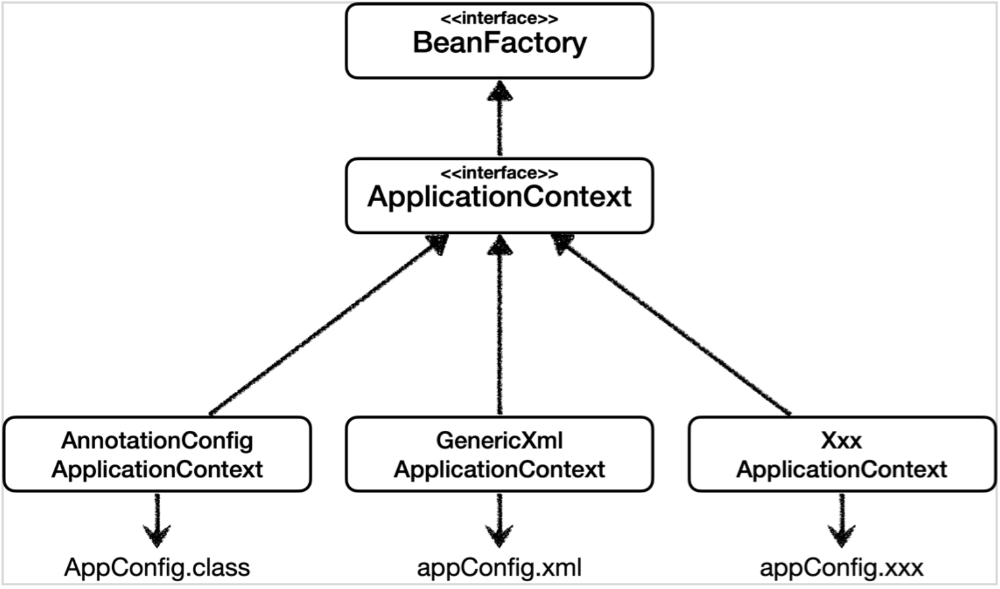

# 03. 스프링 컨테이너와 스프링 빈

---

```java
ApplicationContext applicationContext = new AnnotationConfigApplicationContext(AppConfig.class);
```

- `ApplicationContext`를 스프링 컨테이너라 부른다.
- `ApplicationContext`는 인터페이스다.(다형성 적용, 이를 구현한 구현체를 사용한다)
- 스프링 컨테이너는 `XML` 기반으로 만들 수 있고, **애노테이션 기반의 자바 설정 클래스로 만들 수 있다.**
- 직전에 `AppConfig`를 사용했던 방식이 `애노테이션 기반의 자바 설정 클래스`로 스프링 컨테이너를 만든 것이다.
- 자바 설정 클래스를 기반으로 스프링 컨테이너 `ApplicationContext`를 만들어 보자
    - `new AnnotationConfigApplicationContext(AppConfig.class)`
    - 이 클래스는 `ApplicationContext` 인터페이스의 구현체이다. (참고로 여러개 있다.)

좀 더 정확히 말하면 스프링 컨테이너는 2가지로 나뉜다.

- BeanFactory
- ApplicationContext

## **스프링 컨테이너의 생성 과정**

1. 스프링 컨테이너 생성
2. 스프링 빈 등록
3. 스프링 의존관계 설정 - 준비
4. 스프링 의존관계 설정 - 완료

### 1. 스프링 컨테이너 생성


- **`new AnnotaionConfigApplicationContext(AppConfig.class)` 을 입력하면 위와 같은 스프링 컨테이너가 생성된다.**
- 스프링 컨테이너는 생성되면서 내부적으로 `스프링 빈 저장소`를 갖는다.
- 이때, 생성자에 인자값으로 넘긴 **설정 클래스를 기준으로 `스프링 빈 저장소`를 채워넣을 예정이다.**

### 2. 스프링 빈 등록


- 스프링 컨테이너는 파라미터로 넘어온 설정 클래스 정보를 사용해서 스프링 빈을 등록한다.

**빈 이름**

빈 이름은 메서드 이름을 사용한다.
빈 이름을 직접 부여할 수 도 있다. → 근데 디폴트 지켜라~

> **주의: 빈 이름은 항상 다른 이름을 부여**해야 한다. 같은 이름을 부여하면, 다른 빈이 무시되거나, 기존 빈을
덮어버리거나 설정에 따라 오류가 발생한다.
>

### **3. 스프링 빈 의존관계 설정 - 준비**


### 스프링 빈 의존관계 설정 - 완료


- 스프링 컨테이너는 설정 정보를 참고해서 의존관계를 주입(DI)한다.
- 단순히 자바 코드를 호출하는 것 같지만, 차이가 있다. 이 차이는 뒤에 싱글톤 컨테이너에서 설명한다.

**참고**

스프링은 **빈을 생성** 하고, **의존관계를 주입** 하는 단계가 나누어져있다. 그런데 이렇게 `자바 코드로 스프링 빈을 등록`

하면 **생성자를 호출하면서 의존관계 주입도 한번에 처리한다.** 자세한 내용은 의존관계 자동 주입에서 다시 설명할 예정이다. 중요한 점은, 기본적으로는 **빈을 생성** 하고, **의존관계를 주입** 하는 단계가 나누어져있다.

## 컨테이너에 등록된 모든 빈 조회

---

**모든 빈 출력하기**

- 실행하면 스프링에 등록된 모든 빈 정보를 출력할 수 있다.
- `ac.getBeanDefinitionNames()` 스프링에 등록된 모든 빈 이름을 조회한다.
- `ac.getBean()` 빈 이름으로 객체를 조회한다.

**애플리케이션 빈 출력하기**

- 스프링이 내부에서 사용하는 빈은 제외하고, 내가 등록한 빈만 출력하기
- 스프링이 내부에서 사용하는 빈은 `getRole()`로 구분할 수 있다.
    - ROLE_APPLICATION : 일반적으로 사용자가 정의한 빈
    - ROLE_INFRASTRUCTURE : 스프링 내부에서 사용하는 빈


ac.getBean(빈이름, 타입)

ac.getBean(타입)
조회 대상 스프링 빈이 없으면 예외 발생

`NoSuchBeanDefinitionException: No bean named 'xxxxx' available`

## **BeanFactory와 ApplicationContext**



**BeanFactory**

- 스프링 컨테이너의 최상위 인터페이스다.
- 스프링 빈을 관리하고 조회하는 역할을 한다.
- `getBean()`을 제공한다.
- 우리가 사용했던 대부분의 기능은 `BeanFactory`기능들이었다.

**ApplicationContext**

- `BeanFactory`의 모든 기능을 그대로 제공한다.
- 빈을 관리하고 검색하는 기능을 `BeanFactory`가 이미 해주는데 무슨 차이가 있지?
- 애플리케이션을 개발할 때는 빈을 관리하고 조회하는 기능은 물론, 더 많은 부가기능이 필요하다.
- **메시지 소스를 활용한 국제화 기능 :**한국에서 들어오면 한국어로, 영어권에서 들어오면 영어로 출력 파일을 여러개로 분리해서 들어온 IP에 따라 알맞는 언어로 처리한다.
- **환경변수 :**로컬, 개발, 운영등을 구분해서 처리
- **애플리케이션 이벤트 :** 이벤트를 발행하고 구독하는 모델을 편리하게 지원
- **편리한 리소스 조회 :** 파일, 클래스패스, 외부 등에서 리소스를 편리하게 조회

**정리**

- `ApplicationContext`는 `BeanFactory`의 기능을 상속받는다.
- `ApplicationContext`는 빈 관리기능 + 편리한 부가 기능을 제공한다.
- `BeanFactory`를 직접 사용할 일은 거의 없다. 부가기능이 포함된 `ApplicationContext`를 사용한다.
- `BeanFactory`나 `ApplicationContext`를 스프링 컨테이너라 부른다.