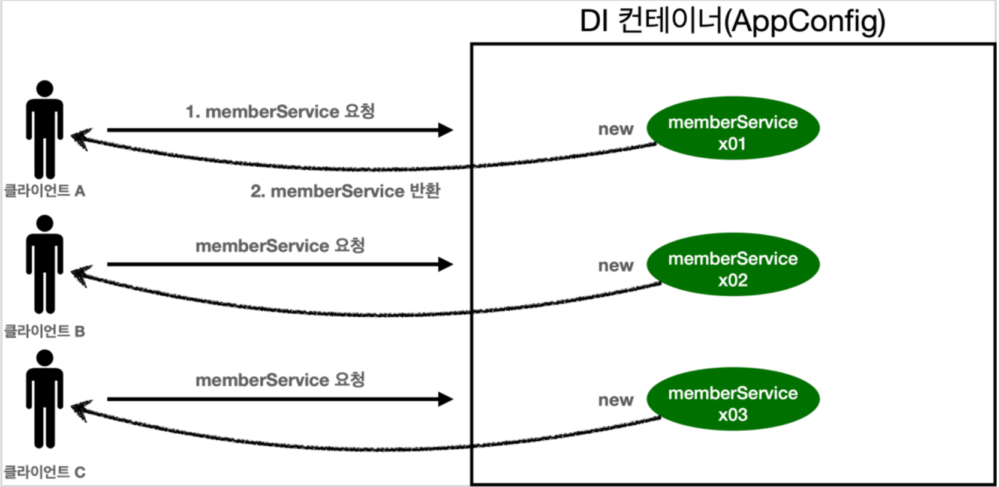
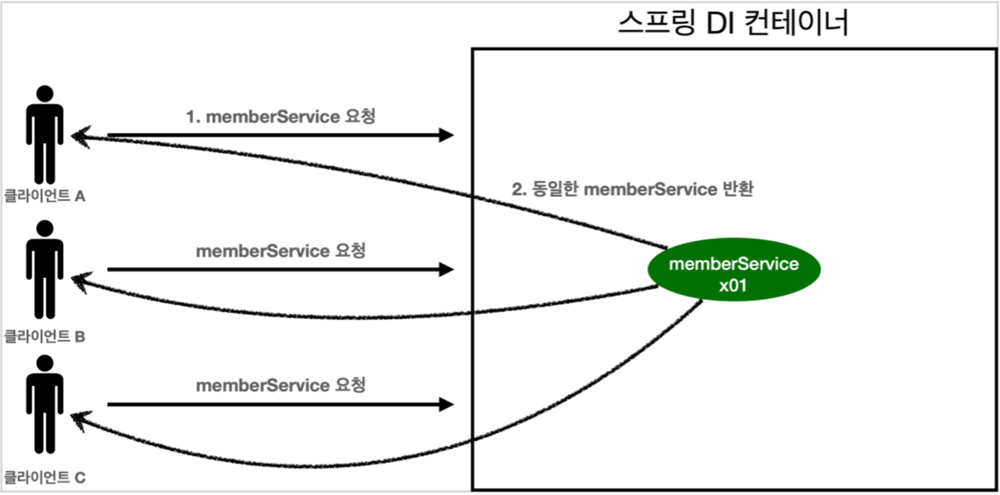

# 04. 싱글톤 컨테이너

## 웹 애플리케이션과 싱글톤



웹 애플리케이션의 특징 중 하나는 **많은 요청 응답이 필요** → 객체 많이 생성됨

지금까지 설계한 AppConfig경우 객체를 불러오면 계속 새롭게 생성 → 1개 부를거 3개부르는

해결방법은? 해당 객체가 딱 1개만 생성되고, 공유하도록 설계하면 된다. → **싱글톤 패턴**

## 싱글톤 패턴

- 클래스의 인스턴스가 딱 1개만 생성되는 것을 보장하는 디자인 패턴이다.
- 같은 객체 인스턴스를 2개 이상 생성하지 못하도록 막는다.

```java
public class SingletonService {

   //1. static 영역에 객체를 딱 1개만 생성해둔다.
   private static final SingletonServiceinstance=new SingletonService();

   //2. public으로 열어서 객체 인스터스가 필요하면 이 static 메서드를 통해서만 조회하도록 허용한다.
   public static SingletonService getInstance(){
      returninstance;
   }

   //3. 생성자를 private으로 선언해서 외부에서 new 키워드를 사용한 객체 생성을 못하게 막는다.
   private SingletonService(){

   }

   public void logic() {
      System.out.println("싱글톤 객체 로직 호출");
   }
}
```

`private`으로 `new` 키워드를 막아두었다.호출할 때 마다 같은 객체 인스턴스를 반환하는 것을 확인할 수 있다.

1. `static` 영역에 객체 `instance`를 미리 하나 생성해서 올려둔다.
2. 이 객체 인스턴스가 필요하면 오직 `getInstance() 메서드`를 통해서만 조회할 수 있다.이 메서드를 호출하면 항상 같은 인스턴스를 반환한다.
3. 딱 1개의 객체 인스턴스만 존재해야 하므로, 생성자를 `private`으로 막아서혹시라도 외부에서 `new` 키워드로 객체 인스턴스가 생성되는 것을 막는다.

### 싱글톤 패턴의 단점

- 싱글톤 패턴을 구현하는 코드 자체가 많이 들어간다.
- 의존관계상 클라이언트가 구체 클래스에 의존한다. DIP를 위반한다.
- 클라이언트가 구체 클래스에 의존해서 OCP 원칙을 위반할 가능성이 높다.
- 테스트하기 어렵다.
- 내부 속성을 변경하거나 초기화 하기 어렵다.
- private 생성자로 자식 클래스를 만들기 어렵다.
- 결론적으로 유연성이 떨어진다.
- 안티패턴으로 불리기도 한다.

## 싱글톤 컨테이너

스프링 컨테이너는 싱글톤 단점을 해결하면서, 객체 인스턴스를 싱글톤으로 관리

**싱글톤 컨테이너**

- 스프링 컨테이너는 별다른 지정을 하지 않을 경우, 객체 인스턴스를 싱글톤으로 관리한다.
- 스프링 컨테이너에서 싱글톤 컨테이너 역할을 하고,싱글톤으로 객체를 관하고 생성하는 기능을 **싱글톤 레지스트리**라 한다.
- **싱글톤 레지스트리** 덕분에 싱글턴 패턴의 모든 단점을 해결하면서 객체를 싱글톤으로 유지할 수 있다.
    - 싱글톤 패턴을 위한 지저분한 코드가 들어가지 않아도 된다.
    - DIP, OCP, 테스트, private 생성자로부터 자유롭게 싱글톤을 사용할 수 있다.

### 싱글톤 컨테이너 적용 후



스프링 컨테이너 덕분에 고객의 요청이 올 때 마다 객체를 생성하는 것이 아니라, 이미 만들어진 객체를 공유해서 효율적으로 재사용할 수 있다.

## 싱글톤 방식의 주의점

- 싱글톤 패턴이든, 스프링 같은 싱글톤 컨테이너를 사용하든, 객체 인스턴스를 하나만 생성해서 공유하는
싱글톤 방식은 여러 클라이언트가 하나의 같은 객체 인스턴스를 공유하기 때문에 싱글톤 객체는 상태를
유지(stateful)하게 설계하면 안된다.
- **무상태(stateless)**로 설계해야 한다!
    - 특정 클라이언트에 의존적인 필드가 있으면 안된다.
    - 특정 클라이언트가 값을 변경할 수 있는 필드가 있으면 안된다!
    - 가급적 읽기만 가능해야 한다.
    - 필드 대신에 자바에서 공유되지 않는, 지역변수, 파라미터, ThreadLocal 등을 사용해야 한다.
- 스프링 빈의 필드에 공유 값을 설정하면 정말 큰 장애가 발생할 수 있다!!!

## @Configuration과 바이트코드 조작의 마법

스프링 컨테이너는 싱글톤 레지스트리다. 따라서 스프링 빈이 싱글톤이 되도록 보장해주어야 한다. 그런데
스프링이 자바 코드까지 어떻게 하기는 어렵다. 저 자바 코드를 보면 분명 3번 호출되어야 하는 것이 맞다.
그래서 스프링은 클래스의 바이트코드를 조작하는 라이브러리를 사용한다.
모든 비밀은 `@Configuration` 을 적용한 `AppConfig` 에 있다.

AppConfig 스프링 빈을 조회해서 클래스 정보를 출력해보자.

`bean = class hello.core.AppConfig$$EnhancerBySpringCGLIB$$bd479d70`

순수한 클래스라면 다음과 같이 출력되어야 한다. `class hello.core.AppConfig`
그런데 예상과는 다르게 클래스 명에 xxxCGLIB가 붙으면서 상당히 복잡해진 것을 볼 수 있다.

이것은 내가 만든 클래스가 아니라 스프링이 CGLIB라는 바이트코드 조작 라이브러리를 사용해서 AppConfig 클래스를 상속받은 임의의 다른 클래스를 만들고, 그 다른 클래스를 스프링 빈으로 등록한 것이다!

**AppConfig@CGLIB 예상 코드**

```java
@Bean
public MemberRepository memberRepository() {

    if (memoryMemberRepository가 이미 스프링 컨테이너에 등록되어 있으면?) {
        return 스프링 컨테이너에서 찾아서 반환;
    } else {
        기존 로직을 호출해서 MemoryMemberRepository를 생성하고 스프링 컨테이너에 등록
        return 반환
    }
}
```

즉, `AppConfig@CGLIB`는 클래스가 싱글톤이 보장되도록 해준다.`@Bean`이 붙은 메서드마다 이미 스프링 빈이 존재하면 존재하는 빈을 반환하고,스프링 빈이 없으면 생성해서 스프링 빈으로 등록하고 반환하는 코드가 동적으로 만들어진다. 이러한 작업 덕분에 싱글톤이 보장되었던 것이다.

참고로 `AppConfig@CGLIB`는 `AppConfig`의 자식 타입이므로,`AppConfig` 타입으로 조회 및 참조할 수 있는 것이다.

그리고 **이러한 동작은 `@Configuration`을 입력했을 때만 가능한 작업이다.**

### 정리

- @Bean만 사용해도 스프링 빈으로 등록되지만, 싱글톤을 보장하지 않는다.
    - 의존관계 주입이 필요해서 메서드를 직접 호출할 때 싱글톤을 보장하지않는다.
- 크게 고민할 것이 없다. **스프링 설정 정보는 항상 @Configuration 을 사용하자.**