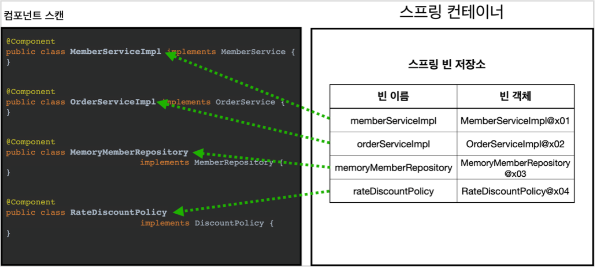
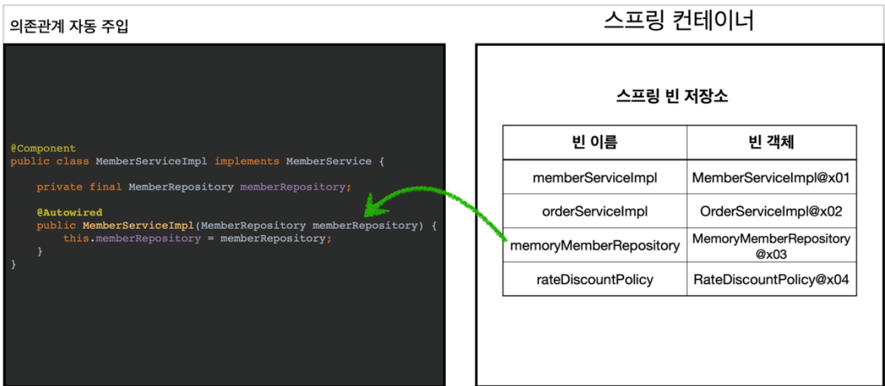

# 05. 컴포넌트 스캔

---

지금까지 우리는 `@Bean`어노테이션을 활용하거나XML 설정 파일을 이용하여 스프링 컨테이너에 직접 빈을 등록했다.하지만, 등록하는 빈의 갯수가 많아질수록 이 또한 번거롭고 귀찮은 작업이 된다.

무엇보다 해당 파일을 일일히 관리해주어야 하는 불편함이 있다.

이를 해소해주기 위해, 스프링에서는 `@ComponentScan`이라는 기능을 제공한다.또 의존관계도 자동으로 주입해주는 `@Autowired`라는 기능도 제공해준다.

**AutoAppConfig**

```java
@Configuration
@ComponentScan(
        excludeFilters = @ComponentScan.Filter(type = FilterType.ANNOTATION, classes = Configuration.class)
)
public class AutoAppConfig {
}
```

이전, `AppConfig`와 비슷한 역할을 하는 `AutoAppConfig`클래스를 생성했다.특이한점은, `@ComponentScan`어노테이션이 붙었고 `@Bean`을 등록한 메소드가 없다.**그렇다면 어떻게 동작을 하는 것인가? 🤔**

우리는 어노테이션의 이름 그대로에서 그 해답을 찾을 수 있다.`@ComponentScan` 어노테이션은 `@Component`어노테이션이 붙은 클래스를 찾는다.그리고 찾은 클래스들을 빈으로 자동 등록해주는 역할을 하고 있다.그렇기에 따로 `@Bean`어노테이션을 붙어서 빈을 등록할 필요가 없기에 이를 제거한 것이다.

한 가지 특이점으로는 `@ComponentScan`에 속성값에 필터 기능을 추가했다.`excludeFilters`은 제외할 클래스를 지정하는데 사용하는 어노테이션 속성이다.이전, 우리가 사용했던 `AppConfig`에서도 우리가 등록한 빈들이 있기에`@ComponentScan`으로 등록할 빈 들과 충돌이 일어나기에 `@Configuration`이 붙은 클래스는 제외한 것이다.

참고로, 컴포넌트 스캔을 사용하면 `@Configuration` 이 붙은 설정 정보도 자동으로 등록된다.`@Configuration` 이 컴포넌트 스캔의 대상이 된 이유도`@Configuration`의 소스코드를 열어보면 `@Component` 어노테이션이 붙어있기 때문이다.

```java
@Component
public class MemoryMemberRepository implements MemberRepository{
```

이런식으로 기존에 Bean 어노테이션을 붇여 빈을 등록했던 클래스에 모두 `@Component` 를 붙여준다.

컴포넌트 스캔과 자동 의존관계 주입이 어떻게 동작하는지 그림으로 알아보자.

**1. @ComponentScan**



`@ComponentScan` 은 `@Component` 가 붙은 모든 클래스를 스프링 빈으로 등록한다.
이때 스프링 빈의 기본 이름은 클래스명을 사용하되 맨 앞글자만 소문자를 사용한다.
**빈 이름 기본 전략:** MemberServiceImpl 클래스 memberServiceImpl

**빈 이름 직접 지정:** 만약 스프링 빈의 이름을 직접 지정하고 싶으면
@Component("memberService2") 이런식으로 이름을 부여하면 된다.

**2. @Autowired 의존관계 자동 주입**



생성자에 @Autowired 를 지정하면, 스프링 컨테이너가 자동으로 해당 스프링 빈을 찾아서 주입한다.

이때 기본 조회 전략은 타입이 같은 빈을 찾아서 주입한다.
getBean(MemberRepository.class) 와 동일하다고 이해하면 된다.

## 탐색 위치와 기본 스캔 대상

**탐색할 패키지의 시작 위치 지정**

모든 자바 클래스를 다 컴포넌트 스캔하면 시간이 오래 걸린다. 그래서 꼭 필요한 위치부터 탐색하도록 시작
위치를 지정할 수 있다.

```java
@ComponentScan(
		 basePackages = "hello.core",
}
```

```
@ComponentScan(
 basePackageClasses = "AutoAppConfig.class",
}
```

 위와 같이 `basePackages`를 선언하여 특정 패키지를 루트로 지정할 수 있다.

- `basePackages = {"hello.core", "hello.service"}`
- `bsePackageClasses` 속성은 지정한 클래스의 패키지를 스캔의 시작 위치로 지정한다.

물론, 현재 클래스가 아닌 다른 클래스를 지정해서 사용해도 되며, 지정하지 않았다면 `@ComponentScan` 이 붙은 설정 정보 클래스의 패키지가 스캔의 시작 위치가 된다

**권장하는 방법**

개인적으로 즐겨 사용하는 방법은 패키지 위치를 지정하지 않고, 설정 정보 클래스의 위치를 프로젝트 최상단에 두는 것이다. 최근 스프링 부트도 이 방법을 기본으로 제공한다.

> 스프링 부트를 사용하면 스프링 부트의 대표 시작 정보인 `@SpringBootApplication` 를 이 프로젝트 시작 루트 위치에 두는 것이 관례이다. (그리고 이 설정안에 바로 `@ComponentScan` 이 들어있다!)
>

### 컴포넌트 스캔 기본 대상

- **@Component :** 컴포넌트 스캔에서 사용
- **@Controlller :** 스프링 MVC 컨트롤러에서 사용
- **@Service :** 스프링 비즈니스 로직에서 사용
- **@Repository :** 스프링 데이터 접근 계층에서 사용
- **@Configuration :** 스프링 설정 정보에서 사용

```
@Component
public @interface Controller {
}
@Component
public @interface Service {
}
@Component
public @interface Configuration {
}
```

어노테이션을 뜯어보면 @Component 어노테이션이 붙여있음

참고 -  어노테이션에는 상속관계라는 것이 없다.

그래서 이렇게 어노테이션이 특정 어노테이션을 들고 있는 것을 인식할 수 있는 것은

자바 언어가 지원하는 기능은 아니고, 스프링이 지원하는 기능이다.

정확히는 스프링에서 제공하는 `어노테이션 프로세서/어노테이션 프로세싱` 을 이용한 방법

스프링의 부가기능

- **@Controller :** 스프링 MVC 컨트롤러로 인식
- **@Repository :** 스프링 데이터 접근 계층으로 인식하고, 데이터 계층의 예외를 스프링 예외로 변환해준다.
- **@Configuration :** 앞서 보았듯이 스프링 설정 정보로 인식하고,스프링 빈이 싱글톤을 유지하도록 추가 처리를 한다.
- **@Service :** 사실 `@Service` 는 특별한 처리를 하지 않는다.대신 개발자들이 핵심 비즈니스 로직이 여기에 있겠구나 라고 비즈니스 계층을 인식하는데 도움이 된다.

### 필터

`@ComponentScan`의 속성중에 특정 빈을 등록하거나 등록하지 않도록 하는 기능이 있다.

- **includeFilters :** 컴포넌트 스캔 대상을 추가로 지정한다.
- **excludeFilters :** 컴포넌트 스캔에서 제외할 대상을 지정한다

이 부분에 대해서 우선, 코드로 동작을 이해하고 정리해보자

**src.test.hello.core.scan.filter.MyIncludeComponent.interface**

```
@Target(ElementType.TYPE)
@Retention(RetentionPolicy.RUNTIME)
@Component
public @interface MyIncludeComponent {

}
```

```
@Target(ElementType.TYPE)
@Retention(RetentionPolicy.RUNTIME)
@Component
public @interface MyExcludeComponent {

}
```

```
@MyIncludeComponent
public class BeanB {
}
```

```
public class ComponentFilterAppConfigTest {

    @Test
    void filterScan() {
        ApplicationContext ac = new AnnotationConfigApplicationContext(ComponentFilterAppConfig.class);
        BeanA beanA = ac.getBean("beanA", BeanA.class);
        assertThat(beanA).isNotNull();

        assertThatThrownBy(()-> ac.getBean("beanB", BeanB.class))
                .isInstanceOf(NoSuchBeanDefinitionException.class);
    }

    @ComponentScan(
            includeFilters = @Filter(type = FilterType.ANNOTATION, classes = MyIncludeComponent.class),
            excludeFilters = @Filter(type = FilterType.ANNOTATION, classes = MyExcludeComponent.class)
    )
    @Configuration
    static class ComponentFilterAppConfig {

    }
}
```

코드에서 알 수 있듯이, 특정 어노테이션에 따라 특정 빈을 등록하거나 예외시키고 있다.

이 과정에서 한 가지 눈여겨 볼 점이 있는데, 바로 `@ComponentScan.FilterType`이다.

**FilterType 옵션**FilterType은 5가지 옵션이 있다.

- **ANNOTATION:** 기본값, 애노테이션을 인식해서 동작한다.
    - ex) org.example.SomeAnnotation
- **ASSIGNABLE_TYPE:** 지정한 타입과 자식 타입을 인식해서 동작한다.
    - ex) org.example.SomeClass
- **ASPECTJ:** AspectJ 패턴 사용
    - ex) org.example..*Service+
- **REGEX:** 정규 표현식
    - ex) org.example.Default.*
- **CUSTOM:** TypeFilter 이라는 인터페이스를 구현해서 처리
    - ex) org.example.MyTypeFilter


→ 최근 스프링 부트는 컴포넌트 스캔을 기본으로 제공하는데, 옵션을 변경하면서 사용하기보다는 스프링의 기본 설정에 최대한 맞추어 사용하는 것을 권장한다.

## 중복 등록과 충돌

컴포넌트 스캔을 사용하면서도 등록된 빈들끼리의 충돌은 언제나 일어날 수 있다.

빈이 충돌나는 경우로 크게 두가지 상황이 있다.

1. 자동 빈 등록 vs 자동 빈 등록

`ConflictingBeanDefinitionException` 예외 발생

1. 수동 빈 등록 vs 자동 빈 등록

**최근 스프링 부트에서는 수동 빈 등록과 자동 빈 등록이 충돌나면 오류가 발생하도록 기본 값을 바꾸었다.**

```
Consider renaming one of the beans or enabling overriding by setting
spring.main.allow-bean-definition-overriding=true
```

오버라이딩 하길 원한다면 위 setting 값을 추가해주면 된다. → 오버라이딩 로그

```
Overriding bean definition for bean 'memoryMemberRepository' with a different
definition: replacing
```